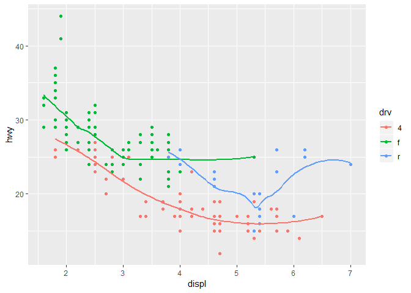

###1. Introduction
import -- loading data into R

wrangle
tidy -- reorganize data such that it's stored in a form that R likes; i.e. each row = observation, each column = variable
transform -- narrowing down or computing new variables

visualization -- shows you the data
model - mathematical or computational thingy with assumptions that answers questions

communication -- sharing the data

Packages and databases to install: tidyverse (pre-installed), nycflights13, gapminder, Lahman

```r
#install.packages(c("nycflights13", "gapminder", "Lahman"))
```

*Note: tidyverse_update() checks for updates

###Explore
####3. Data visualization
####3.2 First steps

```r
library(tidyverse)
```

```
## Registered S3 methods overwritten by 'ggplot2':
##   method         from 
##   [.quosures     rlang
##   c.quosures     rlang
##   print.quosures rlang
```

```
## -- Attaching packages ----------- tidyverse 1.2.1 --
```

```
## v ggplot2 3.1.1     v purrr   0.3.2
## v tibble  2.1.1     v dplyr   0.8.1
## v tidyr   0.8.3     v stringr 1.4.0
## v readr   1.3.1     v forcats 0.4.0
```

```
## -- Conflicts -------------- tidyverse_conflicts() --
## x dplyr::filter() masks stats::filter()
## x dplyr::lag()    masks stats::lag()
```

with ggplot, start with function ggplot(DATASET)
then add layers (e.g. geom_point())
each geom function takes a mapping argument, always paired with aes() which has x and y arguments to specify varabiles

3.2.4 Exercises
1. Run ggplot(data = mpg). What do you see?

```r
ggplot(data = mpg)
```

<!-- -->
I see a big empty gray rectangle.

2. How many rows are in mpg? How many columns?

```r
dim(mpg)
```

```
## [1] 234  11
```
There are 234 rows and 11 columns in mpg.

3. What does the drv variable describe? Read the help for ?mpg to find out.

```r
?mpg
```

```
## starting httpd help server ... done
```
The drv variable describes the type of drive in the car: front-wheel (f), rear wheel (r), or four-wheel (4wd)

4. Make a scatterplot of hwy vs cyl.  (Interpreted as x versus y)
hwy - highway miles per gallon
cyl - number of cylinders
__Why is hwy being used as the x?__

```r
scatter_1 <- ggplot(mpg) +
  geom_point(aes(x = hwy, y = cyl))

scatter_1
```

<!-- -->


5. What happens if you make a scatterplot of class vs drv? Why is the plot not useful?

```r
scatter_2 <- ggplot(mpg) +
  geom_point(aes(x = class, y = drv))

scatter_2
```

<!-- -->
Some classes contain cars with multiple drive types.  Also, neither of these are continuous variables.

####3.3 Aesthetic Mappings
aesthetic - a visual property of an object on the plot (i.e. the size, shape, color)
associate the name of the aesthetic to the name of the variable inside aes()
scaling - ggplot2's assignment of a unique value to the variable

mapable aesthetics
1. color
2. size -- wants ordered variables
3. alpha - transparency
4. shape -- only uses six shapes at a time

ggplot considers x and y locations also aesthetics, which I kind of disagree with, but okay

you can also set the aesthetic properties (color = "blue") manually if it is an argument of the geom() function [not the aes() function]

3.3.1 Exercises
1. What’s gone wrong with this code? Why are the points not blue?
"Color" is an argument of the aes() function, not the geom() function, so it's trying to assign a variable "blue" to color and failing.

```r
ggplot(data = mpg) + 
  geom_point(mapping = aes(x = displ, y = hwy, color = "blue"))
```

<!-- -->

2. Which variables in mpg are categorical? Which variables are continuous? (Hint: type ?mpg to read the documentation for the dataset). How can you see this information when you run mpg?
Categorical: model, trans, drv, fl, class
Continuous: displ, year (?), cyl (?), cty, hwy,

I actually think year and cyl are categorical because there's a finite number of values possible, but I'm not positive.

3. Map a continuous variable to color, size, and shape. How do these aesthetics behave differently for categorical vs. continuous variables?

```r
Q3313 <- ggplot(data = mpg) + 
  geom_point(mapping = aes(x = displ, y = hwy, color = cty))

Q3313
```

<!-- -->
Ooooh, shiny.
When continuous variables are mapped to color or size, the color and size are assigned steps on a gradient.  Shape cannot be mapped to a continous variable.

4. What happens if you map the same variable to multiple aesthetics?

```r
Q3314 <- ggplot(data = mpg) + 
  geom_point(mapping = aes(x = displ, y = hwy, color = cty, size = cty))

Q3314
```

<!-- -->
If you map the same variable to multiple aesthetics, R applies all the aesthetics, which makes sense if you think about how R considers x and y themselves to be aesthetics.  


5. What does the stroke aesthetic do? What shapes does it work with? (Hint: use ?geom_point)

```r
Q3315 <- ggplot(data = mpg) + 
  geom_point(mapping = aes(x = displ, y = hwy, stroke = displ))

Q3315
```

<!-- -->

```r
?geom_point
vignette("ggplot2-specs")
```
After some hunting, it looks like certain shapes in ggplot's arsenal are bordered.  Stroke controls the size of the border.

6. What happens if you map an aesthetic to something other than a variable name, like aes(colour = displ < 5)? Note, you’ll also need to specify x and y.

```r
Q3316 <- ggplot(data = mpg) + 
  geom_point(mapping = aes(x = displ, y = hwy, color = displ < 5))

Q3316
```

<!-- -->
If you give a logical statement or condition to the aesthetic mapping, it colors the result of said statement.


####3.4 Common problems
+ has to come at the end of the line, not the start
( and ) are not matched
typos
read the error message and Google it

####3.5 Facets
facets - subplots that each display one subset of the data
facet_wrap(~ VARIABLE NAME)
"~ VARIABLE NAME" is a formula
the variable should be discrete
facet_wrap() facets for SINGLE variable

facet_grid(VARIABLE ~ OTHER VARIABLE)
facet_grid() facet on multiple variables
to use facet_grid() for one variable, sub "." in for the row or column direction you don't want to facet in (see example code)

```r
ggplot(data = mpg) + 
  geom_point(mapping = aes(x = displ, y = hwy)) + 
  facet_grid(cyl ~ .)
```

<!-- -->

3.5.1 Exercises
1. What happens if you facet on a continuous variable?

```r
#Q3511 <- ggplot(data = mpg) + 
  #geom_point(mapping = aes(x = displ, y = hwy)) + 
  #facet_wrap(cty)

#Q3511
```

Error message: as_facets_list(facets) does not have the continous variable as an object

2. What do the empty cells in plot with facet_grid(drv ~ cyl) mean? How do they relate to this plot?

```r
ggplot(data = mpg) + 
  geom_point(mapping = aes(x = drv, y = cyl)) +
  facet_grid(drv ~ cyl)
```

<!-- -->
The empty facets reflect that there are no observations of those two variable values in the same car.  That is, there is no 5 cylinder car with 4 wheel drive.

3. What plots does the following code make? What does . do?
The first example code creates a scatter plot of hwy (highway miles per gallon) as a function of displ (engine displacement), subset in rows by drive type.  The second example creates the same plot, but subset in columns by cylinder number.  The "." takes the place of the row or column subset variable to enable facet_grid() to be used with one variable instead of two.

4. Take the first faceted plot in this section:

```r
ggplot(data = mpg) + 
  geom_point(mapping = aes(x = displ, y = hwy)) + 
  facet_wrap(~ class, nrow = 2)
```

<!-- -->

What are the advantages to using faceting instead of the colour aesthetic? What are the disadvantages? How might the balance change if you had a larger dataset?
The advantage to faceting over the color aesthetic mean that it's easier to examine what the plot looks like for each faceted class.  You can see that SUVs have a wide range of displacement values that all get pretty much the same hwy mpg.  The stark L shape of subcompact is very obvious.  The disadvantage is that it becomes harder to compare each class with the other when they are not overlaid on top of each other.  
With a larger dataset, a plot with the color aesthetic would likely get quite overplotted with data points.  You still might grasp an overall trend, but it would be very difficult to see the individual patterns.

5. Read ?facet_wrap. What does nrow do? What does ncol do? What other options control the layout of the individual panels? Why doesn’t facet_grid() have nrow and ncol arguments?
nrow and ncol set the number of rows and columns in which to display the individual panels.  as.table lays out facets "like a table," and dir seems to change the direction.

```r
ggplot(data = mpg) + 
  geom_point(mapping = aes(x = displ, y = hwy)) + 
  facet_wrap(~ class, dir = "h")
```

<!-- -->

6. When using facet_grid() you should usually put the variable with more unique levels in the columns. Why?
It squishes less?

####3.6 Geometric objects
geom - geometrical object that a plot uses to represent data

Different geoms have different mappable aesthetics: e.g. geom_smooth has linetype

see ggplot cheatsheet for overview of geomes

group aesthetic can be set to a categorical variable to draw multiple objects but does not add legend or distinguishing feature -- use linetype or color instead in order to do that

multiple geoms can be drawn on the same plot
global mappings -- pass the mapping to the ggplot() function, and ggplot will apply them to each geom

```r
lots_of_typing <- ggplot(data = mpg) + 
  geom_point(mapping = aes(x = displ, y = hwy)) +
  geom_smooth(mapping = aes(x = displ, y = hwy))

less_typing <- ggplot(data = mpg, mapping = aes(x = displ, y = hwy)) +
  geom_point() +
  geom_smooth()

lots_of_typing
```

```
## `geom_smooth()` using method = 'loess' and formula 'y ~ x'
```

<!-- -->

```r
less_typing
```

```
## `geom_smooth()` using method = 'loess' and formula 'y ~ x'
```

<!-- -->

If mappings go inside geom, treated as mappings for that layer only

```r
ggplot(data = mpg, mapping = aes(x = displ, y = hwy)) + 
  geom_point(mapping = aes(color = class)) + 
  geom_smooth()
```

```
## `geom_smooth()` using method = 'loess' and formula 'y ~ x'
```

<!-- -->

Same idea can be used to specify different data

```r
ggplot(data = mpg, mapping = aes(x = displ, y = hwy)) + 
  geom_point(mapping = aes(color = class)) + 
  geom_smooth(data = filter(mpg, class == "subcompact"), se = FALSE)
```

```
## `geom_smooth()` using method = 'loess' and formula 'y ~ x'
```

<!-- -->

3.6.1 Exercises
1. What geom would you use to draw a line chart? A boxplot? A histogram? An area chart?
line chart -- geom_smooth()
boxplot -- geom_boxplot()
histogram -- geom_histogram()
area chart -- geom_area()

2. Run this code in your head and predict what the output will look like. Then, run the code in R and check your predictions.
This code will produce a scatter plot of displ by hwy, colored by the type of drive, with a general, global trendline overlaying the data.

```r
ggplot(data = mpg, mapping = aes(x = displ, y = hwy, color = drv)) + 
  geom_point() + 
  geom_smooth(se = FALSE)
```

```
## `geom_smooth()` using method = 'loess' and formula 'y ~ x'
```

<!-- -->

Oops.  geom_smooth inherits the color aesthetic as well, so the trendlines are for each type of drive, not a global trendline

3. What does show.legend = FALSE do? What happens if you remove it?
Why do you think I used it earlier in the chapter?
show.legend = FALSE removes the automatically generated legend that an aesthetic mapping creates.  It was likely not used in the example above to highlight the similarities between the group mapping and the color mapping.  Also to make that graph fit better in a row with the others.

4. What does the se argument to geom_smooth() do?
Displays a confidence interval around the drawn trendline.

5. Will these two graphs look different? Why/why not?
The graphs will look identical because the same data is being mapped to the same geoms.  The second graph's code is wordier; the first graph's code provides the mapping in the ggplot() call.

6. Recreate the R code necessary to generate the following graphs.

```r
topleft <- ggplot(data = mpg, mapping = aes(x = displ, y = hwy)) +
  geom_point() +
  geom_smooth(se = FALSE)

topright <- ggplot(data = mpg, mapping = aes(x = displ, y = hwy)) +
  geom_point() +
  geom_smooth(mapping = aes(group = drv), se = FALSE)

centerleft <- ggplot(data = mpg, mapping = aes(x = displ, y = hwy, color = drv)) +
  geom_point() +
  geom_smooth(se = FALSE)

centerright <- ggplot(data = mpg, mapping = aes(x = displ, y = hwy)) +
  geom_point(mapping = aes(color = drv)) +
  geom_smooth(se = FALSE)

bottomleft <- ggplot(data = mpg, mapping = aes(x = displ, y = hwy, color = drv, linetype = drv)) +
  geom_point() +
  geom_smooth(color = "blue", se = FALSE)

#This code is not right because the white outline shows up in the legend.
bottomright <- ggplot(data = mpg, mapping = aes(x = displ, y = hwy)) +
  geom_point(mapping = aes(fill = drv), shape = 21, stroke = 2, color = "white")

bottomright2 <- ggplot(data = mpg, mapping = aes(x = displ, y = hwy)) +
  geom_point(size = 4, color = "white") +
  geom_point(mapping = aes(color = drv))


bottomright2
```

<!-- -->

####3.7 Statistical transformations
bar charts, histograms, frequency polygons bin data and plot bin counts
smoothers fit model and plot model predictions
boxplots compute summary and display confusing box

stat -- algorithm used to calculate new values for a graph; statistical transformation
every geom has a default stat; every stat has a default geom

use stat explicitly when:
1. override default (e.g. set height of bar to value instead of count)
2. override default mapping from transformed variables to aesthetics (e.g. want proportion instead of count)
3. draw greater attention: stat_summary()

####3.8 Position adjustments
identity -- places each object where it falls in the context of the graph (overlaps bars, have to set alpha or fill = NA)
stack -- stacks bars within each bar
fill -- makes each bar the same height, easier to compare proportions
dodge -- overlapping objects directly beside each other; compares individual values
jitter -- adds small amount of random noise to spread points out

####3.9 Coordinate system
coord_flip() - switches x and y axes
coord_quickmap() -- sets aspect ratio for maps
coord_polar() -- polar coordinates

####3.10 The layered grammar of graphics
summary: ggplot is awesome
